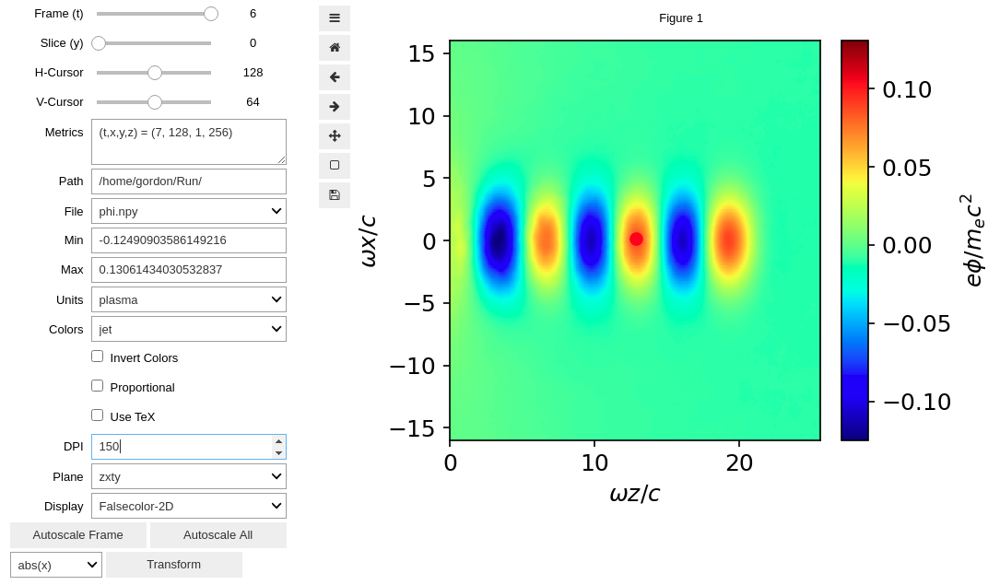
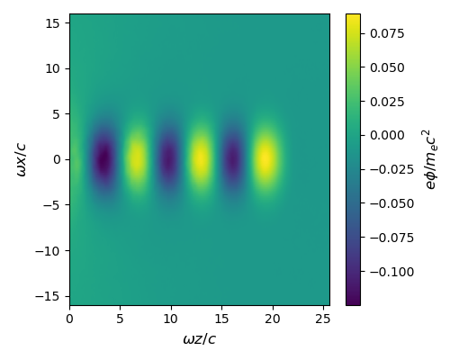
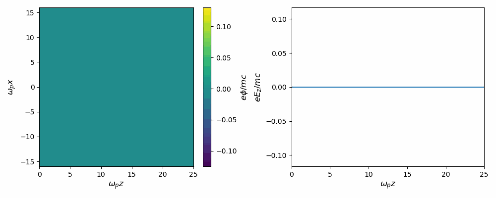

Desktop Runs
============

.. caution::

	This document assumes you have followed the installation instructions precisely.

.. note::

	Once installed, running turboWAVE should be very nearly the same for any desktop system. For Windows, this consistency depends on using the PowerShell as the terminal window.

Running an Example
------------------

#. Pick some example from :samp:`{turboWAVE}/core/examples`.  For this test you should avoid the 3D examples.
#. For definiteness, let us use :samp:`{turboWAVE}/core/examples/pgc/LWFA-coulomb.tw`
#. Open a terminal window and navigate to a directory where you want to run, e.g., :samp:`~/Run` (create it if it doesn't exist).
#. :samp:`cp {twroot}/core/examples/pgc/LWFA-coulomb.tw stdin`
#. This puts the input file in :samp:`~/Run` with the name :samp:`stdin`.  By default, turboWAVE assumes the input file is in the working directory with the name :samp:`stdin`.
#. :samp:`tw3d -n 4`
#. The above command runs the problem with 4 MPI processes and 1 thread per process.  Of course this choice may not be optimal for your system, method of compiling, etc., but it should suffice for this example.
#. As the problem runs, you can press the enter key to prompt turboWAVE to report the current step.  Enter :samp:`help` to get the full list of interactive commands.
#. When the run is finished, you should have several files with the extension :samp:`npy`.  This is a simple binary format often used with numerical Python.

Interactive DataViewer
----------------------

Let us plot the results using the interactive Python DataViewer.

#. Open a terminal window and navigate to :samp:`~/bin`, or wherever :samp:`DataViewer.ipynb` is.
#. Activate your virtual environment (see :doc:`install-easy`)
#. :samp:`jupyter notebook`
#. Click on :samp:`DataViewer.ipynb`
#. Put the cursor in the code cell and click on the button to run the notebook
#. Use the File dropdown to select :samp:`phi.npy`.
#. Advance the Frame slider to the last frame
#. Your window should look something like Fig. 1.

	Fig. 1 --- Python DataViewer output of the scalar potential produced by the :file:`LWFA-coulomb.tw` example.

Command Line Plotter Tutorial
-----------------------------

The command line interface (CLI) plotter allows you to generate animations and publication quality, multi-panel, plots.  The arguments may seem intimidating, but this tool is quite handy once you get the hang of it.  In the following we will start with a simple plot and work toward more complex ones.

#. Activate your virtual environment.
#. :samp:`cd ~/Run`
#. Display the arguments by entering :samp:`twplot`

The last step should display the full range of arguments for the CLI plotter command.  You can examine these later.

The simplest way to invoke the plotter is to use the required arguments only.  For example::

	twplot zxyt=0,-1 phi.npy

Execute this command, taking care not to add spaces.  You should get something like Fig. 2.  The key is to understand the slicing argument.  The first two characters to the left of ``=`` are the axes to plot.  The next two characters are the slicing axes.  The two numbers to the right of ``=`` are matched up with the slicing axes, and determine the slice to select.  Negative slices count from the back, i.e., ``-1`` selects the last slice (in this example the last time index).

	Fig. 1 --- Simplest CLI plot for the :file:`LWFA-coulomb.tw` example.

The axis labels and color scale default to normalized plasma units.  You can add an argument to select from ``mks``, ``cgs``, ``plasma``, ``atomic``, or ``natural`` units::

	twplot zxyt=0,-1 phi.npy units=mks

.. tip::

	Don't forget your shell's capability to recall the last command (typically the up-arrow).  As you build a plot, adding options one at a time, this is invaluable.

This should give the axes and color scale in mks units.  You can also take full control of the labels as follows (n.b. the particulars of escaping special characters may depend on your shell, the following works in ``bash``)::

	twplot zxyt=0,-1 phi.npy texlabels=\\omega_pz,\\omega_px,e\\phiSLASHmc

Notice (i) LaTeX works since we are simply forwarding strings to Matplotlib, and (ii) we have to use ``SLASH`` to get ``/``.  The latter is because, as we will see, the CLI plotter uses ``/`` as a separator.  Next let us animate this plot.  Creating an animation is quite simple, you just use a Python style range as one of the slices.  For example, to animate every time slice::

	twplot zxyt=0,: phi.npy texlabels=\\omega_pz,\\omega_px,e\\phiSLASHmc

This should generate a file called ``mov.gif``.  You can view the movie using standard software.  From Linux you can try ``eog mov.gif``.  From Windows PowerShell you can try ``Start mov.gif``.

Finally let's make a multi-panel animation.  We will show the scalar potential alongside a lineout of the axial electric field::

	twplot zxyt=0,:/zxyt=64,0,: phi.npy,Ez.npy \
	texlabels=\\omega_pz,\\omega_px,e\\phiSLASHmc/\\omega_pz,eE_zSLASHmc \
	roi=0,25,-16,16/0,25,-0.1,0.1

.. tip::

		If you find yourself repeatedly typing the same labels, it may be useful to define a shell variable.  For example, in the ``bash`` shell, we could define ``phi=\\omega_pz,\\omega_px,e\\phiSLASHmc``, and use ``$phi`` as shorthand for this label thereafter.

In this case, each argument is repeated for the new panel.  The panel separator is either ``,`` or ``/``, depending on the argument.  We also used the ``\`` separator to continue the long argument list onto a new line (may be shell dependent).  Finally, the ``roi`` argument is used to fix the vertical scale on the lineout (without this the scale would change from frame to frame).  If everything is working you should get something like Fig. 2.

.. tip::

	The type of plot is inferred from the slices.  Two slices give a 2D plot, three give a lineout.  This documentation does not cover 3D plots, but as a starting point see :samp:`{turboWAVE}/tools/extras/twmaya.py`.

	Fig. 2 --- Two-panel movie for the :file:`LWFA-coulomb.tw` example.

.. _args:

Command line arguments
----------------------

For desktop installations the turboWAVE command line specification is

.. py:function:: tw3d [optional arguments...]

	:samp:`-n <procs>` : number of MPI processes (default=1, desktop only)

	:samp:`-c <threads>` : number of OpenMP threads (see below for default)

	:samp:`--input-file <file>` : name or path of the file to use as the input file (default=stdin)

	:samp:`--platform <search_string>` : select an OpenCL platform with the search string in its name

	:samp:`--device <search_string>` : select an OpenCL device with the search string in its name.  This can also be a comma-delimited list of device numbers.

	:samp:`--restart` : if present, causes initial data to be loaded from a checkpoint.

	:samp:`--no-interactive` : if present, suppresses the interactive thread.

	:samp:`--version` : if present, prints the version number.  If this is the only argument, no simulation is attempted.

	:samp:`--help` : if present, prints the command line arguments and the link to the online documentation.  If this is the only argument, no simulation is attempted.

If you enter only :samp:`tw3d` with no arguments, turboWAVE will use a single MPI processes, and will fork as many threads as there are logical cores on the system.  If you enter :samp:`tw3d -n {procs}`, turboWAVE will use the requested number of MPI processes, but only a single thread.  Finally, if you enter :samp:`tw3d -n {procs} -c {threads}`, turboWAVE will use the requested number for both processes and threads.

When you ran the example above, you may have noticed turboWAVE issuing a warning about the domain decomposition.  That is because if you choose to specify the domain decomposition in the input file, the product of the three integers is supposed to equal the number of processes requested.  If this is not the case, turboWAVE will try to find a suitable decomposition on its own.  There are some rules about how this can be done.  Sometimes turboWAVE will fail to find a suitable decomposition and report an error.

Finally, if you want to disable the interactive thread, add the command line argument :samp:`--no-interactive`.  This can be important for batch processing, because when the interactive thread is used, the :samp:`tw3d` process will not stop without a keystroke from the user.

Error Handling
--------------

It is important to pay attention to the output file if you are having problems.  If the code stops without reporting an error in the terminal window, you may still be able to get some feedback.  The procedure is as follows.

	#. In the input file, add the line :samp:`output level = 1`
	#. This line can go anywhere except within a :samp:`new` block or :samp:`generate` block
	#. Run the problem again
	#. If the error is not reported on the console, try :samp:`grep ERROR *stdout*`
